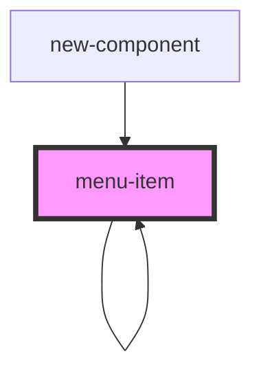

# menu-item

<!-- Auto Generated Below -->

## Properties

| Property          | Attribute          | Description | Type      | Default     |
| ----------------- | ------------------ | ----------- | --------- | ----------- |
| `displayChildren` | `display-children` |             | `boolean` | `undefined` |
| `item`            | `item`             |             | `any`     | `undefined` |
| `showCheckbox`    | `show-checkbox`    |             | `boolean` | `false`     |

## Dependencies

### Used by

 - [menu-item](.)
 - [new-component](../new-component)

### Depends on

- [menu-item](.)

### Graph

----------------------------------------------

*Built with [StencilJS](https://stenciljs.com/)*
